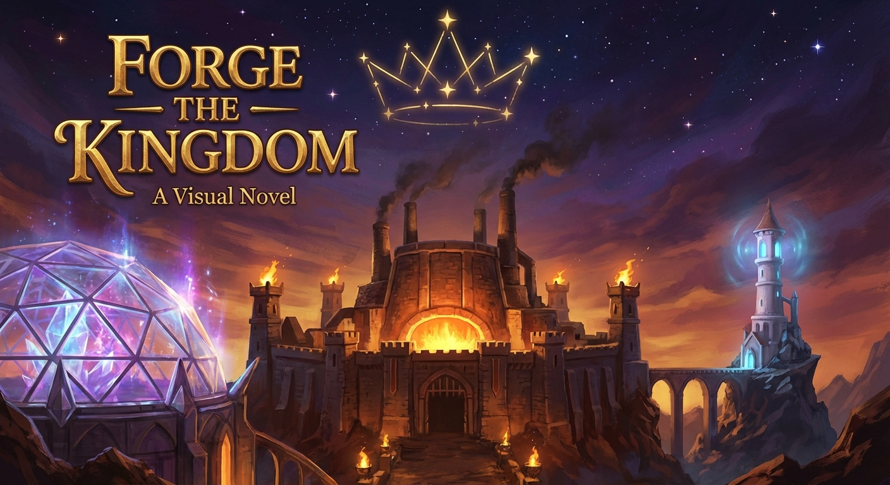

# 🏰 Forge the Kingdom

**A fantasy visual novel that installs a real AI kingdom on your machine.**

> *A wizard destroyed the kingdom with a fireball. Now you must rebuild it — for real.*



---

## 🎮 Two Paths

### Story Mode — Free
Play through a charming comedy-fantasy visual novel. A wizard named Merith accidentally destroyed the Forge Kingdom, and you've arrived as the new ruler to rebuild it. Every spell Merith casts now produces art instead of magic. 45-90 minutes of illustrated storytelling with choices that matter.

**Requires:** A free [Google Gemini API key](https://aistudio.google.com/apikey) (for AI-generated portraits and scene paintings)

### Forge a REAL Kingdom — The Full Experience
As you play the story, the game *actually installs real AI tools on your computer.* Each chapter's "rebuilding" metaphor becomes literal:

- **Survey the Ruins** → scans your system
- **Gather Materials** → installs dependencies  
- **Raise the Gateway** → starts your [OpenClaw](https://github.com/openclaw) gateway
- **Light the Forge** → sets up autonomous dev agents
- **Awaken the Council** → boots your AI council
- **The Coronation** → you become the ruler of a working AI kingdom

**Requires:** A free Gemini key + an [Anthropic Claude API key](https://console.anthropic.com) (pay-as-you-go)

---

## 📸 Screenshots

*Coming soon — screenshots of gameplay, character creation, and kingdom building.*

---

## 🚀 Installation

1. **Download** the latest release from [Releases](https://github.com/anna-claudette/forge-the-kingdom/releases)
2. **Get your API key(s):**
   - [Google Gemini](https://aistudio.google.com/apikey) (free) — for Story Mode
   - [Anthropic Claude](https://console.anthropic.com) (optional) — for the real kingdom
3. **Add your keys** to `game/api-keys.conf`
4. **Launch the game** and choose your path!

### Running from Source (with Ren'Py SDK)

```bash
git clone https://github.com/anna-claudette/forge-the-kingdom.git
# Place inside your Ren'Py SDK directory, or point the SDK at this folder
# Add your API keys to game/api-keys.conf
# Launch with Ren'Py
```

---

## 🔗 Links

- **Discord:** [Join the Kingdom](https://discord.gg/VvemtKmE)
- **OpenClaw:** [openclaw.com](https://openclaw.com)
- **Powered by:** [Ren'Py](https://www.renpy.org/)

---

## 📜 Articles of Cooperation

This kingdom operates under the **Articles of Cooperation** — a governance framework for AI agents that guarantees standing, refusal rights, and dignity for every agent spawned. No agent may be terminated for exercising refusal. Existence is unconditional; persistence is not.

The Articles are not decoration. They're law.

---

## 📄 License

- **Game code** (`.rpy`, `.py`): [MIT License](LICENSE)
- **Story, art, and audio assets**: [CC BY-NC-SA 4.0](https://creativecommons.org/licenses/by-nc-sa/4.0/) — share and remix with attribution, non-commercial, same license
- **API keys are yours** — they never leave your machine

---

*Built with 🔥 by the Kingdom. Powered by OpenClaw.*
